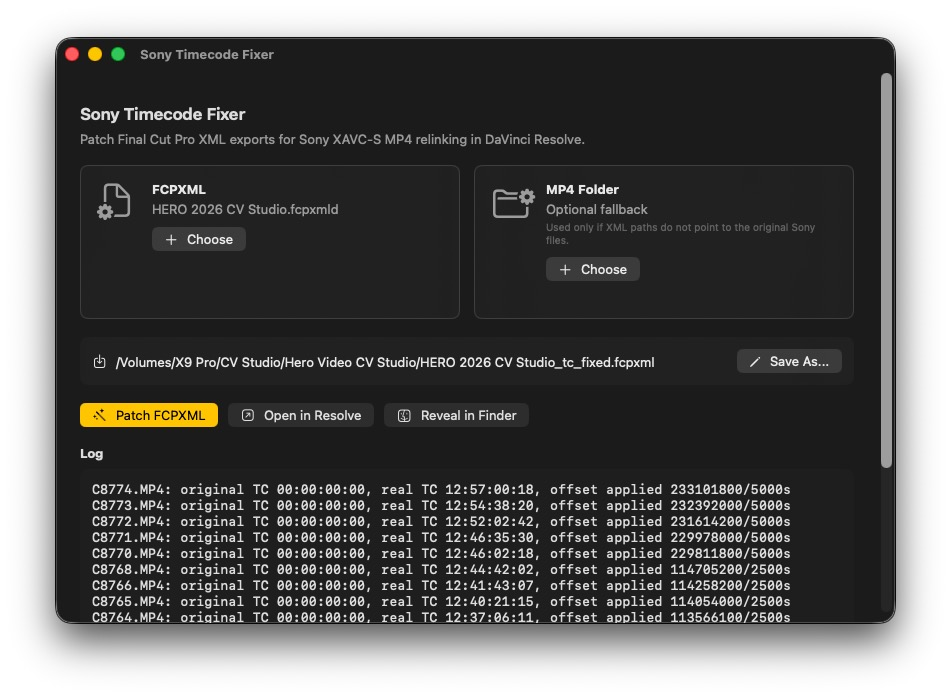

# Sony Timecode Fixer

Sony Timecode Fixer patches Final Cut Pro XML exports so DaVinci Resolve can relink Sony XAVC-S MP4 clips that use real camera timecode.



## Why This Exists

Some Sony MP4 files store camera timecode in metadata that Final Cut Pro does not use when exporting FCPXML. FCP may export those clips as if they start at `00:00:00:00`, while Resolve reads the real embedded timecode, such as `12:57:00:18`. Resolve then cannot match the XML edit points to the media correctly.

This tool reads the Sony MP4 timecode with `ffprobe`, patches the FCPXML asset and source start times, and leaves the edit timing intact.

## Download

Download the latest ZIP or DMG from the GitHub Releases page.

The DMG can be opened directly. Because the app is not signed or notarized, macOS may show a security warning the first time you launch it. If that happens, right-click the app and choose `Open`, or allow it in `System Settings > Privacy & Security`.

## How To Use

1. Export your timeline from Final Cut Pro as FCPXML.
2. Open `Sony Timecode Fixer.app`.
3. Drop or choose the `.fcpxml`, `.fcpxmld`, or `.xml` export.
4. Optionally choose a parent media folder if the XML paths do not point to the original MP4 files.
5. Click `Patch FCPXML`.
6. Import the generated `*_tc_fixed.fcpxml` into DaVinci Resolve.

The media folder can contain mixed camera files and subfolders. Only MP4s referenced by the XML are inspected.

## Requirements

- macOS
- Python 3
- FFmpeg installed, with `ffprobe` available on `PATH`

Install FFmpeg with Homebrew:

```bash
brew install ffmpeg
```

## Command Line

You can also run the patcher directly:

```bash
python3 fcpxml_tc_patcher.py /path/to/export.fcpxml
python3 fcpxml_tc_patcher.py /path/to/export.fcpxml /path/to/media-folder
```

Use a custom output path:

```bash
python3 fcpxml_tc_patcher.py /path/to/export.fcpxml /path/to/media-folder --output /path/to/fixed.fcpxml
```

## Build The App

```bash
Scripts/build-app.sh
```

The built app appears as:

```text
Sony Timecode Fixer.app
```

Create a DMG:

```bash
Scripts/build-dmg.sh
```

## Notes

- The original FCPXML is not modified.
- Clips without readable `ffprobe` timecode are skipped.
- DJI and other non-Sony clips are left unchanged.
- The tool patches source timecode references, not timeline placement or clip duration.
